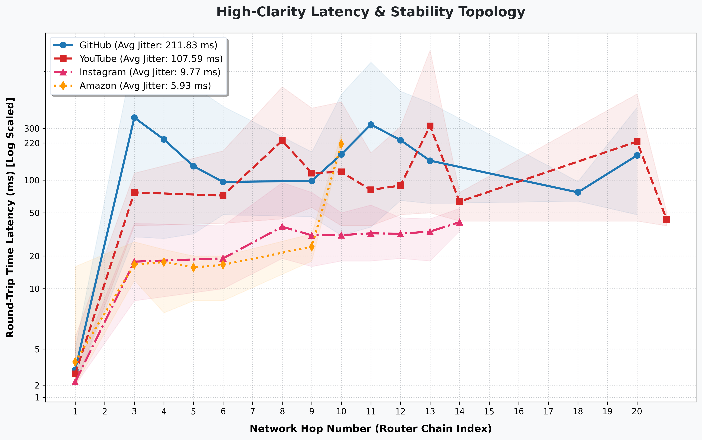
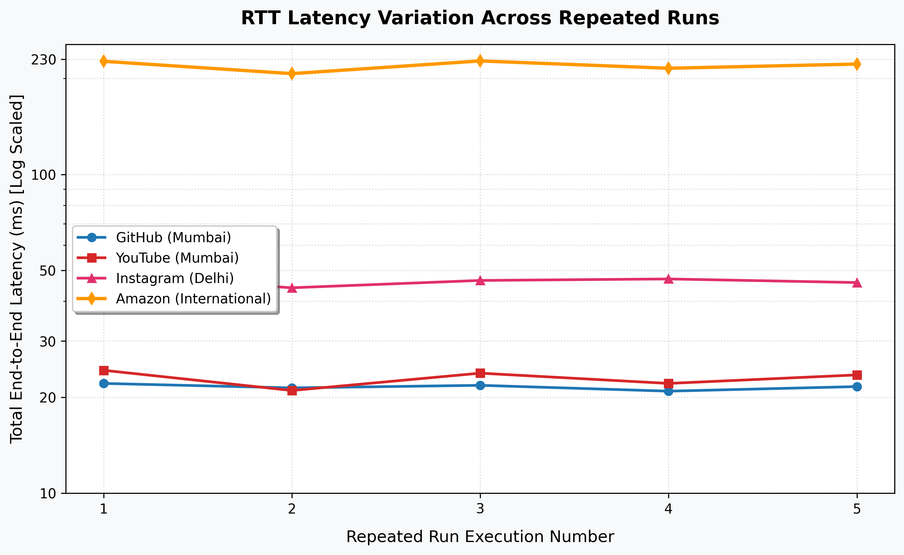

# Multi-Target Network Traceroute & Consistency Analysis

A comprehensive network diagnostic project executing automated multi-run traceroute audits across four major global web architectures (GitHub, YouTube, Instagram, and Amazon). This project evaluates hop-by-hop latency routing structures, calculates mathematical jitter standard deviation consistency values, tracks packet timeout behavior, and visualizes network health topologies.

## 📁 Repository Structure
* `/code`: Houses the Python automated data parsing wrappers, core mathematical logic blocks, and Jupyter data analysis notebooks.
* `/logs`: Raw terminal output diagnostic logs compiled across 5 distinct execution runs.
* `/visuals`: Automatically rendered network health bar profiles, trans-oceanic cable leap indicators, and raw command prompt snapshots.

## 🚀 Execution & Command Automation
The multi-run data sets were gathered sequentially using automated command line loop strings to eliminate manual entry errors:

```bash
# Example for Linux/macOS multi-run automation
for i in {1..5}; do echo "Run \$i" >> target_report.txt; traceroute target.com >> target_report.txt; done
```

## 📊 Analytics Summary

| Target Website | Target Server Edge | Mean RTT Latency | Consistency Status | Primary Routing Characteristic |
| :--- | :--- | :--- | :--- | :--- |
| **GitHub** | Mumbai Hub | Low (~21 ms) | High Stability | Native IPv6 routing wrapper |
| **YouTube** | Mumbai Hub | Low (~23 ms) | High Stability | Direct Google peering edge |
| **Instagram** | Delhi Hub | Moderate (~46 ms) | High Jitter Spikes | Volatile peering handoff boundary |
| **Amazon** | International | High (~220 ms) | Uniform Stability | Fixed trans-oceanic cable delay |

## 📈 Latency Profiling Visualizations

### 1. Network Latency & Stability Profile (Envelope Mapping)
This visualization demonstrates the hop-by-hop average path latency alongside shaded min-to-max envelopes that reveal variance stability performance. The trans-oceanic leap out of local configurations towards international domains is highlighted by a sharp latency spike.



### 2. RTT Latency Variation Across Repeated Runs
Tracks the aggregate network end-to-end latency variations chronologically across the 5 distinct runs, verifying overall cross-log path consistency.



## 💡 Key Architectural Insights

### 1. Latency vs. Consistency Metrics
A key networking takeaway from this experiment is that **high latency does not imply an unstable connection**. Amazon's transatlantic path showcased a high 220ms delay, yet maintained tight, highly consistent performance envelopes. Conversely, Instagram showed lower domestic latency but exhibited higher jitter at regional exchange borders.

### 2. Analysis of Non-Responsive Hops
The presence of asterisks (`* * *`) along the router chains denotes intentional network configuration rather than network packet drop faults. Core routing units frequently drop low-priority diagnostic ICMP frames or ignore artificial TTL-expired probes to prioritize business traffic and prevent unauthorized internal topology layout discoveries.
